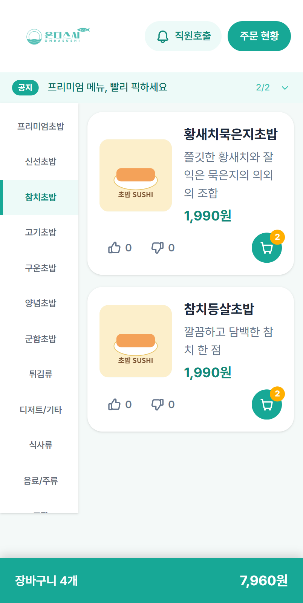
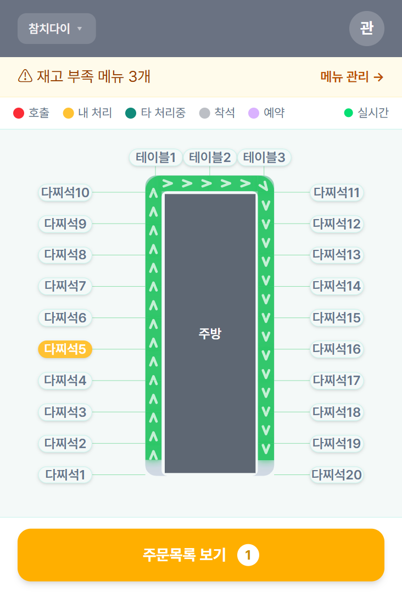
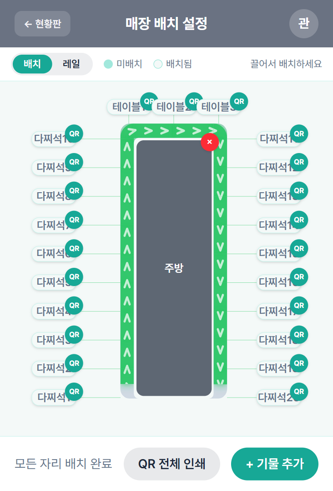

# 🍣 sushiorder-front — 식당 QR 주문 시스템 (프론트엔드)

[sushiorder](https://github.com/JoonOh-Lee/sushiorder) API 서버와 함께 동작하는 프론트엔드입니다. 주말에 스시집에서 직접 일하며 겪은 **주문 전달 과정의 비효율**(홀 직원이 주문을 받아 주방에 구두/수기로 전달하는 과정에서의 누락·지연)을 해결하기 위해, 기획부터 화면 설계·배포까지 방향을 잡고 진행한 개인 프로젝트입니다. **Claude Code를 활용한 바이브코딩**으로 만들었으며, 자세한 개발 방식은 아래 [개발 방식](#개발-방식) 섹션에 정리했습니다.

손님용 QR 주문 화면, 주방/홀 직원이 보는 실시간 현황판, 매장을 운영하는 관리자 화면까지 — 한 매장 운영에 필요한 세 종류의 화면을 하나의 앱으로 구성했습니다.

## 핵심 기능

### 손님 (QR 주문)
- 테이블 QR 스캔 → 테이블 전용 주문 세션 진입 (`/t/:tableId`)
- 메뉴 목록 · 상세 · 장바구니 · 주문 현황 조회
- 영업시간 기반 주문 가능 여부 제어 — 마감 임박 카운트다운, 오픈 전 대기 안내
- 직원 호출 (물 리필 / 문의 / 물품 요청 / 기타), 공지사항 배너

### 홀/주방 직원 — 실시간 현황판
- **매장 평면도 위에 테이블·주방·회전 벨트(레일)를 실제 배치 그대로 시각화**하고, 그 위에 주문 상태를 실시간으로 표시
- 신규 주문은 **WebSocket(STOMP) 우선 수신 + 10초 폴링 폴백**으로 이중화하여, 연결이 끊겨도 현황이 벌어지지 않도록 함
- 스테이션(담당 구역) 배정 · 근무 ON/OFF 토글, 스테이션별 주문 접수/조리완료 처리
- 직원 호출 알림 실시간 수신 및 처리
- 예약 테이블 관리, 재고 부족 메뉴 알림

### 관리자
- 매장 배치(테이블·주방·레일) 편집기 — 드래그로 배치를 바꾸면 컨베이어 벨트 진행 순서가 자동 재계산됨
- 메뉴/공지사항/스테이션/직원 계정 관리, QR 코드 인쇄
- 매출 통계 대시보드, 감사 로그(누가 언제 무엇을 했는지) 조회

## 아키텍처

```
[React 19 + TypeScript + Vite]
        │
        ├─ REST API ─────────────► [Spring Boot 4 API 서버 (sushiorder, 별도 저장소)]
        │
        └─ STOMP WebSocket ◄────── /topic/staff/orders (신규 주문 실시간 push)
```

역할별로 라우트와 인증 방식을 분리했습니다.

| 영역 | 라우트 | 인증 |
|---|---|---|
| 손님 | `/t/:tableId` | 테이블 스코프 세션 토큰 (QR 접근 시 발급, `sessionStorage`) |
| 직원 | `/staff`, `/staff/login` | JWT (`STAFF` / `ADMIN` 역할, 스테이션 배정) |
| 관리자 | `/admin/*` | JWT (`ADMIN` 역할 전용) |

## 개발 방식

이 프로젝트는 **Claude Code를 활용한 바이브코딩**으로 만들었습니다. 정확히는 아래처럼 역할을 나눴습니다.

- **직접 한 것**: 문제 정의(주문 전달 누락/지연), 기능 요구사항, 화면·데이터 흐름 설계, API 계약, 기술적 트레이드오프 판단(예: WebSocket 단독이 아니라 폴링을 보조 채널로 둘지 여부), 코드 리뷰, 로컬 실행/테스트를 통한 동작 검증
- **AI에게 맡긴 것**: 위 결정을 바탕으로 한 실제 코드 구현 대부분

백엔드([sushiorder](https://github.com/JoonOh-Lee/sushiorder)) 저장소와는 이 레포에 남아 있는 `FrontToBackPrompt.md`처럼 API 스펙을 문서로 정리해 전달하는 방식으로, 프론트·백엔드 양쪽에서 각각 AI 코딩 도구를 활용해 작업을 조율했습니다.

실무(SI)에서 다루지 못한 React 19 / Spring Boot 3 / Kubernetes를 "AI가 짠 코드를 얼마나 정확히 검증하고 방향을 잡을 수 있는가"라는 관점에서 이 프로젝트로 실제 검증해보고 싶었던 것이 이 프로젝트를 시작한 이유 중 하나입니다.

### 설계에서 신경 쓴 부분

**1. 회전초밥 벨트의 물리적 배치를 좌표 계산으로 모델링**

실제 매장은 주방을 중심으로 컨베이어 벨트가 사각형으로 감싸는 구조입니다. 관리자가 매장 배치 편집기에서 테이블/주방 위치를 드래그로 옮기면:

- 각 테이블의 2D 좌표를 벨트를 따라가는 1D arc-length 값으로 변환하고 (`tableToArcT`)
- 주방을 가로질러 우회하는 구간(arc-length가 크게 감소하는 지점)을 자동 탐지해 벨트의 시작점을 잡고
- 테이블 그래프(from→to)를 순회하며 진행 순서(`sequenceOrder`)를 재계산해 서버에 반영합니다

이 요구사항을 AI에게 구체적으로 명세하고, 결과 로직이 맞는지는 `railGeometry.ts`에 붙인 Vitest 단위 테스트로 검증했습니다.

**2. 실시간성 — WebSocket과 폴링의 이중 보장**

`useStompOrders`로 신규 주문을 실시간으로 받되, 연결이 끊기거나 재연결 중인 공백을 메우기 위해 `usePolling`으로 10초마다 전체 주문 목록을 다시 가져옵니다. "실시간 push는 빠른 알림용, 폴링은 정합성 보정용"으로 역할을 나누자는 판단은 WebSocket 단독 설계로 테스트하다가 재연결 구간에서 화면과 서버 상태가 어긋나는 걸 확인한 뒤 내린 것입니다.

**3. 손님 세션과 직원 인증을 완전히 분리**

QR로 들어온 손님은 테이블 단위로 격리된 세션 토큰만 갖고, 직원/관리자는 역할 기반 JWT로 별도 인증합니다. 같은 앱이지만 두 인증 체계가 API 계층에서부터 섞이지 않도록 `api/customerApi`와 `api/staff/*`를 분리하도록 요구했습니다.

## 기술 스택

| 구분 | 기술 |
|---|---|
| Framework | React 19, TypeScript, Vite |
| Styling | Tailwind CSS 4 |
| Routing | React Router 7 |
| Realtime | @stomp/stompjs (WebSocket) |
| Test | Vitest |
| Backend | Spring Boot 4 API 서버 ([sushiorder](https://github.com/JoonOh-Lee/sushiorder), 별도 저장소) |

## 실행 방법

이 저장소는 화면(프론트엔드)만 포함합니다. [sushiorder](https://github.com/JoonOh-Lee/sushiorder) API 서버가 먼저 떠 있어야 합니다.

```bash
# 1. 저장소 클론 및 설치
git clone https://github.com/JoonOh-Lee/sushiorder-front.git
cd sushiorder-front
npm install

# 2. 환경 변수 설정
cp .env.example .env
# VITE_API_BASE_URL 을 API 서버 주소로 수정 (기본값 예시: http://localhost:8080)

# 3. 개발 서버 실행
npm run dev
# http://localhost:5173

# 손님 화면: http://localhost:5173/t/{tableId}
# 직원 로그인: http://localhost:5173/staff/login
```

```bash
npm run build     # 프로덕션 빌드
npm run test      # 단위 테스트 (Vitest)
npm run lint       # ESLint
```

## 화면

아래 경로에 이미지 파일을 추가하면 자동으로 표시됩니다.

| 손님 주문 | 직원 현황판 | 관리자 매장 배치 편집 |
|---|---|---|
|  |  |  |

---

## 만들면서 배운 것

- 컨베이어 벨트 좌표/그래프 로직처럼 "정답이 명확한" 문제는, AI에게 구현을 맡기더라도 유닛 테스트로 결과를 직접 검증해야 신뢰할 수 있다는 걸 체감했습니다.
- WebSocket만 믿고 실시간성을 설계하면 재연결 구간에서 화면과 서버 상태가 어긋날 수 있다는 걸 실제로 재현해보고, 폴링을 보조 채널로 추가하는 식으로 요구사항을 구체화하는 연습이 됐습니다.
- AI에게 코드 구현을 맡기는 개발 방식에서는 "코드를 얼마나 잘 짜느냐"보다 "요구사항과 예외 상황을 얼마나 명확히 정의하고, 나온 결과를 얼마나 꼼꼼히 검증하느냐"가 더 중요하다는 걸 배웠습니다.
- 프론트/백엔드 저장소를 분리 운영하면서 API 계약을 문서로 명시하고 두 저장소의 AI 작업을 조율하는 경험을 해봤습니다.
